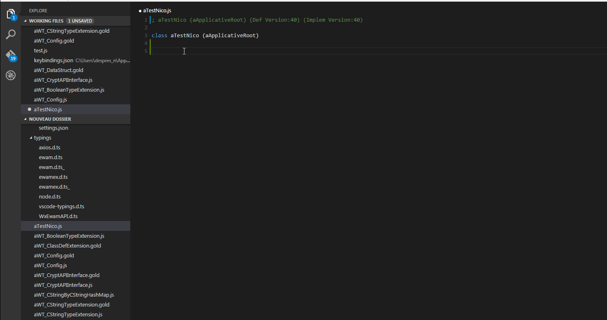

# Visual Studio Code Ewam

This repo is a work in progress as Visual Studio Code is still in Beta by Microsoft.
This plugin leverage the eWam API to let you edit eWam Code With Visual Studio Code.

Parsing, checkin and Scenario edition demo

## Requirements
* Visual Studio Code 10.6
* [ModelAPI v1](https://github.com/MphasisWyde/WydeActiveModelerAPI)

## Installation
* Clone this repo
* Run `npm install`
* Open the folder
* click on F5

## Features
[X] Syntax highlightings (with typescript definitions)  
[X] Watches (with typescript definitions)  
[X] Open a class, `Alt+o`  
[X] Checkin a class `Alt+i` 
[X] Open scenarios `Alt+s` 
[X] Parse `Alt+p` 
[X] Code completion  

## Additional demos
Code completion demo

