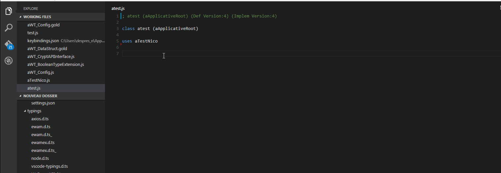
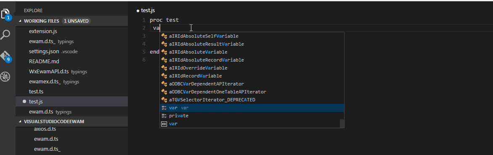

# Visual Studio Code Ewam

This repo is a work in progress as Visual Studio Code is still in Beta by Microsoft.
This plugin leverage the eWam API to let you edit eWam Code With Visual Studio Code.

## Demo
Parsing, checkin and Scenario edition demo

## Requirements
* Visual Studio Code 10.6
* [ModelAPI v1](https://github.com/MphasisWyde/WydeActiveModelerAPI)

## Installation
* Clone this repo
* Run `npm install`
* Open the folder

## Get up and running straight away (Debug mode)
* press `F5` to open a new window with your extension loaded
* run your command from the command palette by pressing (`Ctrl+Shift+P` or `F1`) and typing `ewam`
* set breakpoints in `extension.ts` to debug the extension
* find output from your extension in the debug console

## Features
- [x] Syntax highlightings (with typescript definitions)  
- [x] Watches (with typescript definitions)  
- [x] Open a class, `Alt+o`  
- [x] Checkin a class `Alt+i` 
- [x] Open scenarios `Alt+s` 
- [x] Parse `Alt+p` 
- [x] Code completion  

## Additional demos
### Code completion

